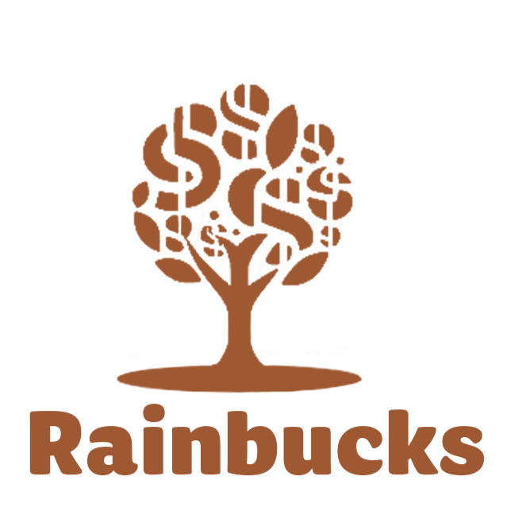

# Rainbucks – Skill Tech Platform ✨

A modern, database-driven skill-tech website built with PHP and MySQL featuring dynamic content, course packages, testimonials, and an admin dashboard.

<p align="center">
  <a href="#">🖥️ Live Demo</a> •
  <a href="#-features">Features</a> •
  <a href="#-tech-stack">Tech Stack</a> •
  <a href="#-getting-started">Getting Started</a> •
  <a href="#-screenshots">Screenshots</a> •
  <a href="#-license">License</a>
</p>

<p align="center">
  
  
  
  
  
</p>

> Replace the Live Demo link with your deployment URL, e.g., https://your-domain.com

---

## 🚀 Overview

Rainbucks is a full-featured skill-tech site with:

- 🎯 Dynamic homepage content (hero, announcements, courses)
- 📦 Course packages with pricing and details
- 🗣️ Featured testimonials (with graceful fallback)
- 🔐 Admin dashboard for managing content, packages, and testimonials
- 🧩 Modular PHP (PDO) helpers and secure prepared statements
- 🎨 Responsive UI with custom CSS, Font Awesome, Google Fonts, and Swiper.js

---

## 🧰 Tech Stack

- **Frontend**: HTML5, CSS3, Vanilla JS, Font Awesome, Google Fonts, Swiper.js
- **Backend**: PHP (PDO, prepared statements)
- **Database**: MySQL
- **Server**: Apache (XAMPP/LAMP/WAMP) or Nginx (PHP-FPM)

---

## 📂 Project Structure

```
Rainbucks/
├─ index.php                     # Public homepage (dynamic content)
├─ public/                       # Public assets and pages
│  ├─ styles.css, script.js
│  ├─ img/                       # Images
│  └─ package/                   # Package pages and scripts
├─ admin/                        # Admin dashboard (login, CRUD)
│  ├─ login.php, dashboard.php, packages.php, courses.php, testimonials.php
│  └─ api/                       # Admin-related APIs (e.g., bundle_management.php)
├─ includes/                     # Config, DB, setup helpers, SQL
│  ├─ config.php                 # DB credentials (edit this)
│  ├─ db.php                     # PDO connection + helpers
│  ├─ create_admin.php           # Create default admin (one-click init)
│  └─ *.sql                      # Database schema and setup scripts
├─ assets/                       # Images and media assets
└─ README.md
```

---

## ⚙️ Requirements

- PHP 7.4+ (PHP 8.x recommended)
- MySQL 5.7/8.0
- Apache (XAMPP/LAMP/WAMP) or Nginx

Optional: XAMPP on Windows (recommended for quick local setup)

---

## 🏁 Getting Started

1) Clone the repository

```bash
git clone https://github.com/your-username/Rainbucks.git
```

2) Create the database

- Create a MySQL database (default name in code: `rainbucks`).
- Import one of the setup SQL files from `includes/`:
  - `rainbucks_combined_setup.sql` (recommended full setup)
  - `rainbucks.sql` (base schema) or `clean_setup.sql`

3) Configure database credentials

Edit `includes/config.php`:

```php
$host = 'localhost';
$username = 'root';
$password = '';
$database = 'rainbucks';
```

4) Create an admin user (optional but handy)

- Open in your browser: `http://localhost/Rainbucks/includes/create_admin.php`
- This creates an admin with:
  - Email: `admin@mywebsite.com`
  - Password: `admin123`
- Then log in at: `http://localhost/Rainbucks/admin/login.php`

5) Run the app

- Local (XAMPP): Place the folder under `htdocs/` and visit: `http://localhost/Rainbucks/`
- Or configure your virtual host / Nginx server block accordingly.

---

## 🔐 Security Notes

- Change the default admin email/password immediately in the admin panel or by editing the script.
- Never commit real production credentials.
- Disable `display_errors` in production.

---

## ✨ Features

- **Dynamic content system**: Hero, announcements, and featured courses
- **Packages module**: Manage course bundles and pricing
- **Testimonials**: Featured testimonials with rating support
- **Admin dashboard**: Authentication, CRUD for content/modules
- **Responsive UI**: Modern, accessible, and mobile-friendly

---

## 🖼️ Screenshots

Add your screenshots here (e.g., from the `public/img` or custom uploads):

```

```

---

## 🧪 Development Tips

- Use the `debug_*` and `test_*` helper scripts in the root/admin/includes for diagnostics.
- SQL migrations/updates are available in `includes/*.sql`.

---

## 🤝 Contributing

- Fork the repo and create a feature branch.
- Follow clear commit messages.
- Open a PR with a concise description and screenshots if UI changes.

---

## 📜 License

This project is licensed under the MIT License — see the `LICENSE` file for details.

If you don't have a license file yet, create one quickly with the standard MIT template.

---

## 📣 Links

- 🖥️ Demo: https://your-demo-url.com
- 📄 Terms & Policies: see `public/` (privacy-policy.php, terms-conditions.php, etc.)
- 🛠️ Admin Login: `/admin/login.php`

---

## 🙌 Acknowledgements

- Font Awesome, Google Fonts, Swiper.js
- XAMPP for quick local development

---

Made with ❤️ by the Rainbucks team.